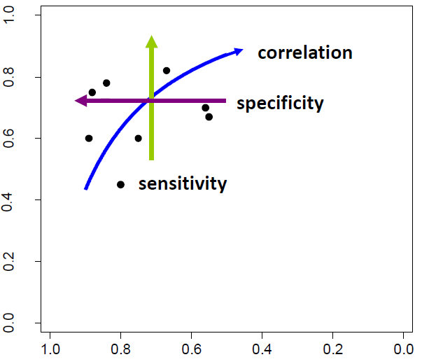
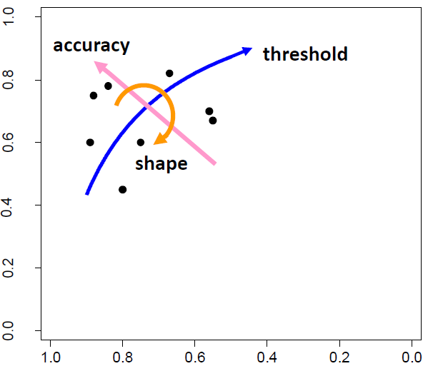

```{r setup, message=F, warning=F, render=F, echo=F}
if(params$presentation) options(width=60)
knitr::opts_chunk$set(echo = TRUE)
library(tidyverse)
library(kableExtra)
library(mada)
library(readxl)
```

## Recap

- Important points from previous sessions

# Perfect Reference Test

## DTA-MA: perfect reference test

- There is an increasing interest in meta-analyzing data from diagnostic accuracy studies

- The data from the primary studies are summarized in a 2-by-2 cross-tabulation of the dichotomized test result against the true disease status (assuming we have a perfect reference test)

```{r, echo=F}
df <- tibble("  " = c("T+", "T-"),
             "D+" = c("TP", "FN"),
             "D-" = c("FP", "TN"))

df %>% kable()
```
---

## DTA-MA: perfect reference test

- Serological tests for covid-19 from 5 studies (but 6 observations) on evaluation of ELISA assay for covid-19 (Bastos et al 2020).

```{r, echo=F}
library(readxl)
d <- read_excel("data/bastos_serological_covid_2020.xlsx") 

d %>%
  kable() %>%
  kable_styling(full_width = F, font_size = 10) 
```

## DTA-MA: perfect reference test

- Forest plot of sensitivity

```{r, echo=F, fig.height=5}
forest(madad(d),
       snames=d$Study,
       type = "sens",
       main = "Sensitivity")
```


## DTA-MA: perfect reference test

- Forest plot of specificity

```{r, echo=F, fig.height=5}
forest(madad(d),
       snames=d$Study,
       type = "spec",
       main = "Specificity")
```


## DTA-MA: perfect reference test

- Data points with confidence ellipses on a ROC space

```{r, fig.width=5, fig.height=5, echo=F}
ROCellipse(d, pch = "")
points(fpr(d), sens(d))
```


## DTA-MA: perfect reference test

Two main frameworks:

- Hierarchical Summary ROC (Rutter and Gatsonis 2001) 

- Bivariate analysis of sensitivity and specificity (Reitsma et al. 2005)


## DTA-MA: bivariate analysis of sensitivity and specificity




---


## DTA-MA: hierarchical summary ROC (HSROC)




## DTA-MA: bivariate analysis of sensitivity and specificity

Some notation/definitions (no covariates)

$$(\mu_{A_i} \mu_{B_i}) \sim N((\mu_A \mu_B), \Sigma_{AB})$$
  
  with 

$$ \Sigma_{AB} = \begin{pmatrix}
\sigma^2_A    & \sigma^2_{AB} \\\
\sigma^2_{AB} & \sigma^2_B 
\end{pmatrix}
$$

$\mu_{A_i}$ is the logit-transformed sensitivity in study $i$
$\mu_{B_i}$ is the logit-transformed specificity in study $i$

---


## DTA-MA: hierarchical summary ROC (HSROC)

Some notation/definitions (no covariates)

- level I (within study)

$logit(\pi_{ij})=(\theta_i + \alpha_i D_{ij}) \cdot exp(-\beta \cdot D_{ij})$

- level II (between studies)

$\theta_i \sim N(\Theta, \sigma^2_\theta)$

$\alpha_i \sim N(\Lambda, \sigma^2_\alpha)$

$\theta_i$ are cutpoint parameters (or positivity criteria)

$\alpha_i$ are accuracy parameters

$\beta$ is a shape parameter, allowing true-positive and false-positive fractions to increase at different rates as $\theta_i$ increases

---


## DTA-MA: bivariate analysis of sensitivity and specificity

Let's run the model with reitsma function (mada R package)

```{r}
fit.reitsma <- reitsma(d)
```


## DTA-MA: bivariate analysis of sensitivity and specificity

```{r echo=F}
round(summary(fit.reitsma)[[1]][,c(1,5,6)], 2)
```


## DTA-MA: bivariate analysis of sensitivity and specificity

```{r, fig.width=6, fig.height=6, echo=FALSE}
plot(fit.reitsma, cex = 2,
     sroclwd = 2, plotsumm = T,predict = T,pch = 19,
     main = "")
points(fpr(d),
       sens(d), pch = 1)
legend("bottomright",
       c("data points", "summary estimate", "SROC", "95% conf. region", "95% pred.region"),
       pch = c(1, 19, NA, NA, NA),
       lwd = c(NA, 2, 2, 1, 1),
       lty = c(NA, NA, 1,1,3),
       bty = "n")
```

---


## DTA-MA: bivariate analysis of sensitivity and specificity

- Where is the summary measure of heterogeneity?

- There is $I^2$ for DTA-MA?

---


## DTA-MA: bivariate analysis of sensitivity and specificity

The function returns also HSROC parameters
\small
```{r echo=F}
print(summary(fit.reitsma)[20], digits = 2)
```
\normalsize

---

## DTA-MA: bivariate analysis of sensitivity and specificity

This is because Bivariate and HSROC approaches are equivalent when covariates are not included (Harbord et al. 2007)

- Parameter estimates from either model can be used to produce a summary operating point, an SROC curve, confidence regions, or prediction regions. 

- The choice between these parameterizations depends partly on the degrees of and reasons for between-study heterogeneity and the treshold effect.


# Imperfect Reference Test

## DTA-MA: imperfect reference test(s)

Why?

- Ignoring the imperfect nature of the reference may result in biased estimates of pooled sensitivity and specificity of the test under evaluation


## DTA-MA: imperfect reference test(s)

How?

- Multivariate generalized linear mixed model (MGLMM)

- Hierarchical summary receiver operating characteristic (HSROC)

- Exact relations between the parameters of these models can be provided.

- But some submodels of the MGLMM do not have corresponding equivalent submodels of the HSROC model, and vice versa.

---


## DTA-MA: HSROC for imperfect reference test(s)

Dendukuri et al. Biometrics. 2012

- The data from the primary studies are summarized in a 2-by-2 cross-tabulation of the index test ($T_1$) result against the imperfect refernce ($T_2$)

```{r, echo=FALSE, message=FALSE}
library(kableExtra)
library(tidyverse)
d = matrix(c("p*se*s2+(1-p)*(1-sp)*(1-c2)", "p*se*(1-s2)+(1-p)*(1-sp)*c2",
             "p*(1-se)*s2+(1-p)*sp*(1-c2)", "p*(1-se)*(1-s2)+(1-p)*sp*c2"), 
           nrow = 2,
           dimnames = list(c("T1+","T1-"),c("T2+","T2-")))
d %>%
  kable() %>%
  kable_styling(full_width = F, font_size = 10)
```

The sensitivity and the specificity of the reference test are defined as:

- $S_2 = P(T_2=+|D+)$
- $C_2 = P(T_2=-|D-)$

---


## DTA-MA: discussion

- Comments?

- Questions?

- Ideas?

---


## DTA-MA: hierarchical summary ROC (HSROC)

Let's do it with rjags

---

## DTA-MA with JAGS: Likelihood

\small
```{r, echo=F}
dta_ma <- c("model {

	for(i in 1:l) {
		# Likelihood	
		# se, sp are accuracy of CI
		# s2, c2 are accuracy of LU
		# pi is the prevalence

		cell[i,1:4] ~ dmulti(prob[i,1:4],n[i])
	
		prob[i,1] <- pi[i]*se[i]*s2+(1-pi[i])*(1-sp[i])*(1-c2)
		prob[i,2] <- pi[i]*se[i]*(1-s2)+(1-pi[i])*(1-sp[i])*c2
		prob[i,3] <- pi[i]*(1-se[i])*s2+(1-pi[i])*sp[i]*(1-c2)
		prob[i,4] <- pi[i]*(1-se[i])*(1-s2)+(1-pi[i])*sp[i]*c2

","

		# Expressing accuracy in terms of HSROC parameters

		b[i] <- exp((beta)/2)
		logit(se[i]) <- (theta[i] + 0.5*alpha[i])/b[i]
		logit(sp[i]) <- -(theta[i] - 0.5*alpha[i])*b[i]

		# Priors for CI accuracy
		theta[i] ~ dnorm(THETA,prec[1])
		alpha[i] ~ dnorm(LAMBDA,prec[2]) 

","
		# Priors for prevalence parameters
		pi[i] ~ dbeta(1,1)
	}
	
","

	# CI accuracy
	Se_overall <- 1/(1+exp((-THETA-0.5*LAMBDA)/exp(beta/2)))
	Sp_overall <- 1/(1+exp((THETA-0.5*LAMBDA)*exp(beta/2)))		
	
	theta_new ~ dnorm(THETA,prec[1])
	alpha_new ~ dnorm(LAMBDA,prec[2])
	
","

	# Predicted values for CI in a new study
	Se_new <- 1/(1+exp(-(theta_new+0.5*alpha_new)/exp(beta/2)))
	Sp_new <- 1/(1+exp((theta_new-0.5*alpha_new)*exp(beta/2)))

","

	# Priors over the accuracy parameters of CI
	THETA ~ dunif(-2.6,2.6) 
	LAMBDA ~ dunif(-5.2,5.2)
	beta ~ dunif(-1.3,1.3)

	for(j in 1:2) {
		
			prec[j] <- pow(sigma[j],-2) 
			sigma[j] ~ dgamma(4,2)	
	}

","

	# Priors over the accuracy parameters of the imperfect reference test (LU)

		###	Informative Priors	###
		s2 ~ dbeta(36.279, 13.761);
		c2 ~ dbeta(67.181, 9.597);

		###	Non-Informative 	###
		#s2 ~ dbeta(1,1);
		#c2 ~ dbeta(1,1);

	#data# l, n, cell
	#inits# LAMBDA, THETA, beta, pi, sigma
	#monitor# c2, s2, Se_overall ,Sp_overall


}")
cat(dta_ma, sep='', file='dta_ma.bug')
cat(dta_ma[1], sep='\n')
```


## DTA-MA with JAGS: model specifications

\small
```{r, echo=F}
cat(dta_ma[2], sep='\n')
```


## DTA-MA with JAGS: model specifications

```{r, echo=F}
cat(dta_ma[3], sep='\n')
```


## DTA-MA with JAGS:  model specifications

\small
```{r, echo=F}
cat(dta_ma[4], sep='\n')
```

## DTA-MA with JAGS:  model specifications

\small
```{r, echo=F}
cat(dta_ma[5], sep='\n')
```


## DTA-MA with JAGS:  model specifications

\small
```{r, echo=F}
cat(dta_ma[6], sep='\n')
```


## Exercise 

Use Timsit paper data (Prev Vet Med 2016)

```{r, echo=FALSE}
brd = data.frame(TP = c(49, 37, 265, 121, 195, 157, 127),
                 FP = c(53, 1, 196, 42, 60, 29, 157),
                 FN = c(38, 90, 606, 910, 1395, 1344, 4591),
                 TN = c(64, 18, 969, 592, 373, 806, 8316))
brd %>%
  mutate(StudyID = c("Gardner", "Buhman", "Thompson", "Schneider", "Leach", "Tennant", "Rezac")) %>%
  dplyr::select(StudyID, TP, FP, FN, TN) %>%
  kable() %>%
  kable_styling(full_width = F, font_size = 9) 
```

1. Fit a bivariate model assuming perfect reference with reitsma() in mada
2. Fit a HSROC model assuming imperfect reference with HSROC() in HSROC
3. Fit a HSROC model assuming imperfect reference with model definitions in rjags
